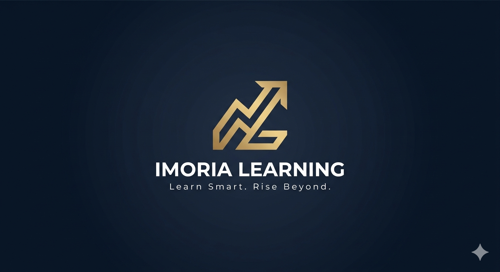

# 🔱 Imoria Learning Platform

  
   
  <b>Learn Smart. Rise Beyond.</b>
   
  <i>An Enterprise-Grade EdTech Ecosystem for FSc, MDCAT, and ECAT Preparation.</i>

---

## 🚀 Project Overview
Imoria Learning is a premium, high-scalable educational platform engineered to provide conceptual clarity to intermediate (FSc) students and competitive exam aspirants (MDCAT/ECAT) across Pakistan. Built with modern microservices architecture, the platform features a computer-based testing (CBT) engine, AI-powered student diagnostics, and high-fidelity interactive flowcharts.

## 🏗️ Ecosystem Architecture (Monorepo)

- **`apps/web-frontend`**: Next.js & TailwindCSS student portal tailored for high-speed content delivery and seamless reading layouts.
- **`apps/admin-dashboard`**: Management panel for educators to seamlessly upload premium notes, high-resolution diagrams, and manage MCQ bank metadata.
- **`apps/mobile-app`**: Flutter cross-platform mobile application ensuring an offline-first premium experience for students on iOS and Android.
- **`apps/backend-api`**: Robust Node.js (NestJS) microservice controlling authentication, adaptive quiz logic, and deep performance analytics.

---

## 🎨 Core Theme Identity
Based on the official **logo.png**, the ecosystem strictly utilizes the following signature design token:
*   **Primary Palette**: Deep Space Navy `#0B132B` (For modern, strain-free late-night study sessions).
*   **Accent Palette**: Premium Regal Gold `#D4AF37` / `#FFD700` (For active UI highlights, call-to-actions, and interactive vectors).
*   **Typography**: Clean, high-legibility Sans-Serif font hierarchy built for academic endurance.

---

## ⚙️ Development Phase Sequence

1. **Phase 1: Architecture & Master UI/UX** ➔ Base structure setup and master UI design tokens integration.
2. **Phase 2: Core Web Portal & Content Modules** ➔ Finalizing Chapter-wise Notes, Flowcharts, Short & Long Qs interfaces.
3. **Phase 3: CBT Mock Test Engine** ➔ Real-time timed quiz engine with instant logic explanations and national leaderboards.
4. **Phase 4: AI Insights & Mobile Sync** ➔ Integrating personalized weak-topic analytical engine and multi-platform mobile application release.

---
© 2026 Imoria Learning. All Rights Reserved.
